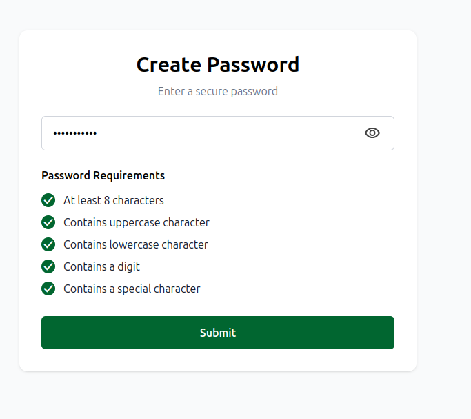

# Password Strength Checker (React + TypeScript + Tailwind)

A minimal, accessible password creation form with real-time strength checks.  
It validates length, uppercase, lowercase, digit, and special character **without using regex**, and includes a show/hide toggle for the password field.

## Preview

## Features

- Real-time validation of five rules:
  - At least 8 characters
  - Contains uppercase character
  - Contains lowercase character
  - Contains a digit
  - Contains a special character
- No regular expressions (pure character checks)
- Show/Hide password (eye toggle)
- Clear, accessible checklist with visual and screen-reader feedback
- Submit button enabled only when all rules pass (easily configurable)

## Tech Stack

- **React** + **TypeScript**
- **Tailwind CSS**
- **Vite** (for fast dev/build)

## How It Works

- The password is analyzed on each keystroke by a small utility function in `src/utils/password.ts`.  
  It scans characters once and sets flags based on:
  - Uppercase: `'A'..'Z'`
  - Lowercase: `'a'..'z'`
  - Digit: `'0'..'9'`
  - Special: any non-alphanumeric, non-whitespace
  - Length: `pw.length >= 8`
- The UI (`App.tsx`) maps those flags to a checklist of items.  
- The input is **controlled**: `value` comes from state; `onChange` updates it.  
- The eye button toggles between `type="password"` and `type="text"`.

## Accessibility

- `aria-label` on the input and toggle button for screen readers
- `aria-pressed` reflects the toggle’s on/off state
- Decorative icons are hidden with `aria-hidden="true"`
- Visible focus styles on interactive elements

## Project Structure

